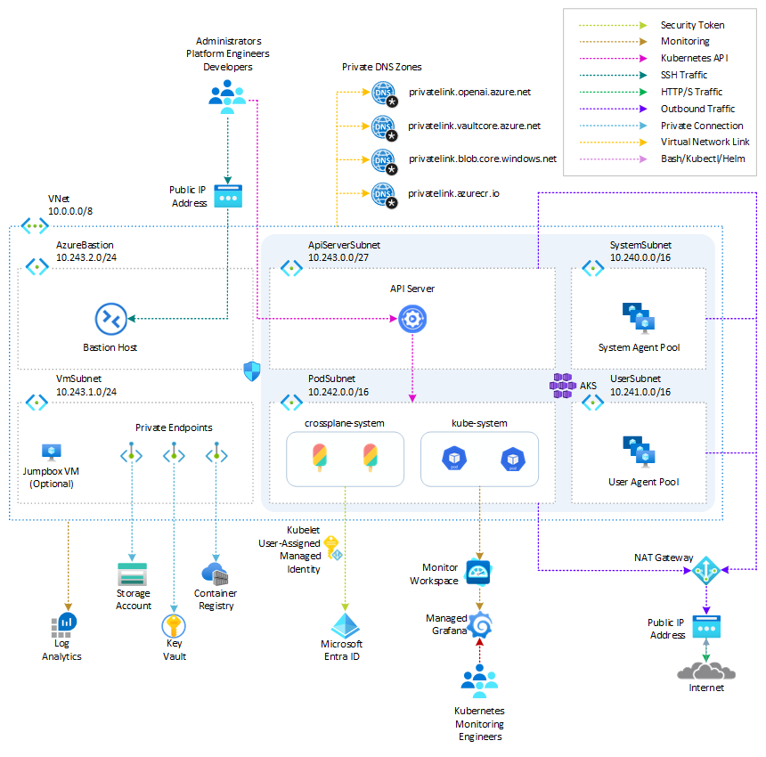

# Deploy an Azure Kubernetes Service cluster with Crossplane using Terraform

In this sample, I shows how to automate the deployment via Terraform of an [Azure Kubernetes Service (AKS)](https://docs.microsoft.com/en-us/azure/aks/intro-kubernetes) cluster with [Crossplane](https://www.crossplane.io/) and the [Upbound Azure Providers](https://marketplace.upbound.io/providers/upbound/provider-family-azure/v0.42.0).

[Crossplane](https://docs.crossplane.io/latest/) is an open source Kubernetes extension that transforms your Kubernetes cluster into a universal control plane. Crossplane lets you manage anything, anywhere, all through standard Kubernetes APIs. Crossplane can even let you order a pizza directly from Kubernetes. If it has an API, Crossplane can connect to it. With Crossplane, platform teams can create new abstractions and custom APIs with the full power of Kubernetes policies, namespaces, role based access controls and more. Crossplane brings all your non-Kubernetes resources under one roof. Custom APIs, created by platform teams, allow security and compliance enforcement across resources or clouds, without exposing any complexity to the developers. A single API call can create multiple resources, in multiple clouds and use Kubernetes as the control plane for everything.

For more information, see:

- [Crossplane Overview](https://docs.crossplane.io/latest/)
- [Crossplane Getting Started](https://docs.crossplane.io/latest/getting-started/)
- [Crossplane Azure Quickstart](https://docs.crossplane.io/v1.14/getting-started/provider-azure/)

> **NOTE**  
> You can find the `architecture.vsdx` file used for the diagram under the `visio` folder.

## Prerequisites

- An active [Azure subscription](https://docs.microsoft.com/en-us/azure/guides/developer/azure-developer-guide#understanding-accounts-subscriptions-and-billing). If you don't have one, create a [free Azure account](https://azure.microsoft.com/free/) before you begin.
- [Visual Studio Code](https://code.visualstudio.com/) installed on one of the [supported platforms](https://code.visualstudio.com/docs/supporting/requirements#_platforms) along with the [HashiCorp Terraform](https://marketplace.visualstudio.com/items?itemName=HashiCorp.terraform).
- Azure CLI version 2.49.0 or later installed. To install or upgrade, see [Install Azure CLI](https://learn.microsoft.com/en-us/cli/azure/install-azure-cli).
- `aks-preview` Azure CLI extension of version 0.5.140 or later installed
- [Terraform v1.5.2 or later](https://developer.hashicorp.com/terraform/downloads).
- The deployment must be started by a user who has sufficient permissions to assign roles, such as a `User Access Administrator` or `Owner`.
- Your Azure account also needs `Microsoft.Resources/deployments/write` permissions at the subscription level.

## Architecture

The following diagram shows the architecture and network topology deployed by the sample:



This project provides a set of Terraform modules to deploy thw following resources:

- [Azure Kubernetes Service](https://registry.terraform.io/providers/hashicorp/azurerm/latest/docs/resources/kubernetes_cluster):  A public or private [Azure Kubernetes Service(AKS)](https://docs.microsoft.com/en-us/azure/aks/intro-kubernetes) cluster composed of a:
  - A `system` node pool in a dedicated subnet. The default node pool hosts only critical system pods and services. The worker nodes have node taint which prevents application pods from beings scheduled on this node pool.
  - A `user` node pool hosting user workloads and artifacts in a dedicated subnet.
- [User-defined Managed Identity](https://registry.terraform.io/providers/hashicorp/azurerm/latest/docs/resources/user_assigned_identity): a user-defined managed identity used by the AKS cluster to create additional resources like load balancers and managed disks in Azure.
- [Azure Virtual Machine](https://registry.terraform.io/providers/hashicorp/azurerm/latest/docs/resources/linux_virtual_machine): Terraform modules can optionally create a jump-box virtual machine to manage the private AKS cluster.
- [Azure Bastion Host](https://registry.terraform.io/providers/hashicorp/azurerm/latest/docs/resources/bastion_host): a separate Azure Bastion is deployed in the AKS cluster virtual network to provide SSH connectivity to both agent nodes and virtual machines.
- [Azure NAT Gateway](https://registry.terraform.io/providers/hashicorp/azurerm/latest/docs/resources/nat_gateway): a bring-your-own (BYO) [Azure NAT Gateway](https://learn.microsoft.com/en-us/azure/virtual-network/nat-gateway/nat-overview) to manage outbound connections initiated by AKS-hosted workloads. The NAT Gateway is associated to the `SystemSubnet`, `UserSubnet`, and `PodSubnet` subnets. The [outboundType](https://learn.microsoft.com/en-us/azure/aks/egress-outboundtype#outbound-type-of-managednatgateway-or-userassignednatgateway) property of the cluster is set to `userAssignedNatGateway` to specify that a BYO NAT Gateway is used for outbound connections. NOTE: you can update the `outboundType` after cluster creation and this will deploy or remove resources as required to put the cluster into the new egress configuration. For more information, see [Updating outboundType after cluster creation](https://learn.microsoft.com/en-us/azure/aks/egress-outboundtype#updating-outboundtype-after-cluster-creation-preview).
- [Azure Storage Account](https://registry.terraform.io/providers/hashicorp/azurerm/latest/docs/resources/storage_account): this storage account is used to store the boot diagnostics logs of both the service provider and service consumer virtual machines. Boot Diagnostics is a debugging feature that allows you to view console output and screenshots to diagnose virtual machine status.
- [Azure Container Registry](https://registry.terraform.io/providers/hashicorp/azurerm/latest/docs/resources/container_registry): an Azure Container Registry (ACR) to build, store, and manage container images and artifacts in a private registry for all container deployments.
- [Azure Key Vault](https://registry.terraform.io/providers/hashicorp/azurerm/latest/docs/resources/key_vault): an Azure Key Vault used to store secrets, certificates, and keys that can be mounted as files by pods using [Azure Key Vault Provider for Secrets Store CSI Driver](https://github.com/Azure/secrets-store-csi-driver-provider-azure). For more information, see [Use the Azure Key Vault Provider for Secrets Store CSI Driver in an AKS cluster](https://learn.microsoft.com/en-us/azure/aks/csi-secrets-store-driver) and [Provide an identity to access the Azure Key Vault Provider for Secrets Store CSI Driver](https://learn.microsoft.com/en-us/azure/aks/csi-secrets-store-identity-access).
- [Azure Private Endpoints](https://registry.terraform.io/providers/hashicorp/azurerm/latest/docs/resources/private_endpoint): an [Azure Private Endpoint](https://docs.microsoft.com/en-us/azure/private-link/private-endpoint-overview) is created for each of the following resources:
  - Azure Container Registry
  - Azure Key Vault
  - Azure Storage Account
  - API Server when deploying a private AKS cluster.
- [Azure Private DNDS Zones](https://registry.terraform.io/providers/hashicorp/azurerm/latest/docs/data-sources/private_dns_zone): an [Azure Private DNS Zone](https://docs.microsoft.com/en-us/azure/dns/private-dns-overview) is created for each of the following resources:
  - Azure Container Registry
  - Azure Key Vault
  - Azure Storage Account
  - API Server when deploying a private AKS cluster.
- [Azure Network Security Group](https://registry.terraform.io/providers/hashicorp/azurerm/latest/docs/data-sources/network_security_group): subnets hosting virtual machines and Azure Bastion Hosts are protected by [Azure Network Security Groups](https://docs.microsoft.com/en-us/azure/virtual-network/network-security-groups-overview) that are used to filter inbound and outbound traffic.
- [Azure Log Analytics Workspace](https://registry.terraform.io/providers/hashicorp/azurerm/latest/docs/resources/log_analytics_workspace): a centralized [Azure Log Analytics](https://docs.microsoft.com/en-us/azure/azure-monitor/logs/log-analytics-workspace-overview) workspace is used to collect the diagnostics logs and metrics from all the Azure resources:
  - Azure Kubernetes Service cluster
  - Azure Key Vault
  - Azure Network Security Group
  - Azure Container Registry
  - Azure Storage Account
  - Azure jump-box virtual machine
- [Azure Monitor workspace](https://registry.terraform.io/providers/hashicorp/azurerm/3.83.0/docs/resources/monitor_workspace): An [Azure Monitor workspace](https://learn.microsoft.com/en-us/azure/azure-monitor/essentials/azure-monitor-workspace-overview) is a unique environment for data collected by [Azure Monitor](https://learn.microsoft.com/en-us/azure/azure-monitor/essentials/data-platform-metrics). Each workspace has its own data repository, configuration, and permissions. Log Analytics workspaces contain logs and metrics data from multiple Azure resources, whereas Azure Monitor workspaces currently contain only metrics related to [Prometheus](https://learn.microsoft.com/en-us/azure/azure-monitor/essentials/prometheus-metrics-overview). Azure Monitor managed service for Prometheus allows you to collect and analyze metrics at scale using a Prometheus-compatible monitoring solution, based on the [Prometheus](https://aka.ms/azureprometheus-promio). This fully managed service allows you to use the [Prometheus query language (PromQL)](https://aka.ms/azureprometheus-promio-promql) to analyze and alert on the performance of monitored infrastructure and workloads without having to operate the underlying infrastructure. The primary method for visualizing Prometheus metrics is [Azure Managed Grafana](https://learn.microsoft.com/en-us/azure/managed-grafana/overview). You can connect your [Azure Monitor workspace](https://learn.microsoft.com/en-us/azure/azure-monitor/essentials/azure-monitor-workspace-overview) to an [Azure Managed Grafana](https://learn.microsoft.com/en-us/azure/managed-grafana/overview) to visualize Prometheus metrics using a set of built-in and custom Grafana dashboards.
- [Azure Managed Grafana](https://registry.terraform.io/providers/hashicorp/azurerm/latest/docs/resources/dashboard_grafana): an [Azure Managed Grafana](https://learn.microsoft.com/en-us/azure/managed-grafana/overview) instance used to visualize the [Prometheus metrics](https://learn.microsoft.com/en-us/azure/azure-monitor/containers/prometheus-metrics-enable?tabs=azure-portal) generated by the [Azure Kubernetes Service(AKS)](https://docs.microsoft.com/en-us/azure/aks/intro-kubernetes) cluster deployed by the Bicep modules. [Azure Managed Grafana](https://learn.microsoft.com/en-us/azure/managed-grafana/overview) is a fully managed service for analytics and monitoring solutions. It's supported by Grafana Enterprise, which provides extensible data visualizations. This managed service allows to quickly and easily deploy Grafana dashboards with built-in high availability and control access with Azure security.
- [NGINX Ingress Controller](https://docs.nginx.com/nginx-ingress-controller/): this sample compares the managed and unmanaged NGINX Ingress Controller. While the managed version is installed using the [Application routing add-on](https://learn.microsoft.com/en-us/azure/aks/app-routing), the unmanaged version is deployed using the [Helm Terraform Provider](https://registry.terraform.io/providers/hashicorp/helm/latest/docs). You can use the Helm provider to deploy software packages in Kubernetes. The provider needs to be configured with the proper credentials before it can be used.
- [Argo CD](https://argo-cd.readthedocs.io/en/stable/): Argo CD follows the GitOps pattern of using Git repositories as the source of truth for defining the desired application state. The package is installed via `Helm`.
- [Crossplane](https://cert-manager.io/docs/): Crossplane is installed via `Helm` with a configurable collection of Upbound Azure Providers. The `ConfigProvider` is created via a `YAML manifest` and configured to use the `kubelet` user-assigned managed identity to connect to Azure. This identity is assigned the `Owner` role over the Azure subscription. For more information, see [Authentication using User-Assigned Managed Identities](https://github.com/upbound/provider-azure/blob/main/AUTHENTICATION.md#authentication-using-user-assigned-managed-identities).
- [Cert-Manager](https://cert-manager.io/docs/): the `cert-manager` package and [Let's Encrypt](https://letsencrypt.org/) certificate authority are used to issue a TLS/SSL certificate to the chat applications.
- [Prometheus](https://prometheus.io/): the AKS cluster is configured to collect metrics to the [Azure Monitor workspace](https://learn.microsoft.com/en-us/azure/azure-monitor/essentials/azure-monitor-workspace-overview) and [Azure Managed Grafana](https://learn.microsoft.com/en-us/azure/managed-grafana/overview). Nonetheless, the [kube-prometheus-stack](https://artifacthub.io/packages/helm/prometheus-community/kube-prometheus-stack) Helm chart is used to install [Prometheus](https://prometheus.io/) and [Grafana](https://grafana.com/) on the AKS cluster.
- Workload namespace and service account: the [Kubectl Terraform Provider](https://registry.terraform.io/providers/cpanato/kubectl/latest/docs) and [Kubernetes Terraform Provider](https://registry.terraform.io/providers/hashicorp/kubernetes/latest/docs) are used to create the namespace and service account used by the chat applications.
- Azure Monitor ConfigMaps for [Azure Monitor managed service for Prometheus](https://learn.microsoft.com/en-us/azure/azure-monitor/essentials/prometheus-metrics-overview) and `cert-manager` [Cluster Issuer](https://cert-manager.io/docs/configuration/) are deployed using the [Kubectl Terraform Provider](https://registry.terraform.io/providers/cpanato/kubectl/latest/docs) and [Kubernetes Terraform Provider](https://registry.terraform.io/providers/hashicorp/kubernetes/latest/docs).`

## Test Scripts

The `scripts` folder contains the following files Bash scripts to test Crossplane when the deployment completed. 

### Composite Resource Definition

The following script creates a test [CompositeResourceDefinition](https://docs.crossplane.io/latest/concepts/composite-resource-definitions/). Composite resource definitions (XRDs) define the schema for a custom API. The XRD `spec` contains all the information about the API including the `group`, `version`, `kind` and `schema`. The XRD’s `name` must be the combination of the `plural` and `group`. The `schema` uses the `OpenAPIv3` specification to define the API `spec`. The API defines a `location` that must be `oneOf` either `EU` or `US`. Apply this XRD to create the custom API in your Kubernetes cluster.

```bash
#!/bin/bash

# Create the CompositeResourceDefinition for the VirtualMachine resource
cat <<EOF | kubectl apply -f -
apiVersion: apiextensions.crossplane.io/v1
kind: CompositeResourceDefinition
metadata:
  name: virtualmachines.compute.example.com
spec:
  group: compute.example.com
  names:
    kind: VirtualMachine
    plural: virtualmachines
  versions:
  - name: v1alpha1
    schema:
      openAPIV3Schema:
        type: object
        properties:
          spec:
            type: object
            properties:
              location:
                type: string
                oneOf:
                  - pattern: '^EU$'
                  - pattern: '^US$'
            required:
              - location
    served: true
    referenceable: true
  claimNames:
    kind: VirtualMachineClaim
    plural: virtualmachineclaims
EOF
```

Adding the `claimNames` allows you to access this API either at the cluster level with the `VirtualMachine` endpoint or in a namespace with the `VirtualMachineClaim` endpoint. The namespace scoped API is a Crossplane [Claim](https://docs.crossplane.io/latest/concepts/claims/).

> **NOTE**  
> For more details on the fields and options of Composite Resource Definitions read the [XRD documentation](https://docs.crossplane.io/latest/concepts/composite-resource-definitions/).

You can display the installed XRD with the `kubectl get xrd` command.

```bash
1kubectl get xrd
2NAME                                  ESTABLISHED   OFFERED   AGE
3virtualmachines.compute.example.com   True          True      43s
```

You can view the new custom API endpoints running the `kubectl api-resources | grep VirtualMachine` command.

```shell
1kubectl api-resources | grep VirtualMachine
2virtualmachineclaims              compute.example.com/v1alpha1           true         VirtualMachineClaim
3virtualmachines                   compute.example.com/v1alpha1           false        VirtualMachine
```

## Composition

When you access the custom API Crossplane takes their inputs and combines them with a template describing what infrastructure to deploy. Crossplane calls this template a [Composition](https://docs.crossplane.io/latest/concepts/compositions/). A `Composition` defines all the cloud resources to deploy. Each entry in the template is a full resource definitions, defining all the resource settings and metadata like labels and annotations. This template creates an Azure `LinuxVirtualMachine` `NetworkInterface`, `Subnet` `VirtualNetwork` and `ResourceGroup`. Crossplane uses `patches` to apply your input to the resource template. This `Composition` takes your `location` input and uses it as the `location` used in the individual resource. Apply this `Composition` to your cluster.

```bash
#!/bin/bash

# Create the Composition for the VirtualMachine resource
cat <<EOF | kubectl apply -f -
apiVersion: apiextensions.crossplane.io/v1
kind: Composition
metadata:
  name: crossplane-quickstart-vm-with-network
spec:
  resources:
    - name: quickstart-vm
      base:
        apiVersion: compute.azure.upbound.io/v1beta1
        kind: LinuxVirtualMachine
        spec:
          forProvider:
            adminUsername: adminuser
            adminSshKey:
              - publicKey: ssh-rsa
                  AAAAB3NzaC1yc2EAAAADAQABAAABAQC+wWK73dCr+jgQOAxNsHAnNNNMEMWOHYEccp6wJm2gotpr9katuF/ZAdou5AaW1C61slRkHRkpRRX9FA9CYBiitZgvCCz+3nWNN7l/Up54Zps/pHWGZLHNJZRYyAB6j5yVLMVHIHriY49d/GZTZVNB8GoJv9Gakwc/fuEZYYl4YDFiGMBP///TzlI4jhiJzjKnEvqPFki5p2ZRJqcbCiF4pJrxUQR/RXqVFQdbRLZgYfJ8xGB878RENq3yQ39d8dVOkq4edbkzwcUmwwwkYVPIoDGsYLaRHnG+To7FvMeyO7xDVQkMKzopTQV8AuKpyvpqu0a9pWOMaiCyDytO7GGN
                  example@docs.crossplane.io
                username: adminuser
            location: "Central US"
            osDisk:
              - caching: ReadWrite
                storageAccountType: Standard_LRS
            resourceGroupNameSelector:
              matchControllerRef: true
            size: Standard_B1ms
            sourceImageReference:
              - offer: debian-11
                publisher: Debian
                sku: 11-backports-gen2
                version: latest
            networkInterfaceIdsSelector:
              matchControllerRef: true
      patches:
        - type: FromCompositeFieldPath
          fromFieldPath: "spec.location"
          toFieldPath: "spec.forProvider.location"
          transforms:
            - type: map
              map: 
                EU: "Sweden Central"
                US: "Central US"
    - name: quickstart-nic
      base:
        apiVersion: network.azure.upbound.io/v1beta1
        kind: NetworkInterface
        spec:
          forProvider:
            ipConfiguration:
              - name: crossplane-quickstart-configuration
                privateIpAddressAllocation: Dynamic
                subnetIdSelector:
                  matchControllerRef: true
            location: "Central US"
            resourceGroupNameSelector:
              matchControllerRef: true
      patches:
        - type: FromCompositeFieldPath
          fromFieldPath: "spec.location"
          toFieldPath: "spec.forProvider.location"
          transforms:
            - type: map
              map: 
                EU: "Sweden Central"
                US: "Central US"            
    - name: quickstart-subnet
      base:
        apiVersion: network.azure.upbound.io/v1beta1
        kind: Subnet
        spec:
          forProvider:
            addressPrefixes:
              - 10.0.1.0/24
            virtualNetworkNameSelector:
              matchControllerRef: true
            resourceGroupNameSelector:
              matchControllerRef: true
    - name: quickstart-network
      base:
        apiVersion: network.azure.upbound.io/v1beta1
        kind: VirtualNetwork
        spec:
          forProvider:
            addressSpace:
              - 10.0.0.0/16
            location: "Central US"
            resourceGroupNameSelector:
              matchControllerRef: true
      patches:
        - type: FromCompositeFieldPath
          fromFieldPath: "spec.location"
          toFieldPath: "spec.forProvider.location"
          transforms:
            - type: map
              map: 
                EU: "Sweden Central"
                US: "Central US"
    - name: crossplane-resourcegroup
      base:
        apiVersion: azure.upbound.io/v1beta1
        kind: ResourceGroup
        spec:
          forProvider:
            location: Central US
      patches:
        - type: FromCompositeFieldPath
          fromFieldPath: "spec.location"
          toFieldPath: "spec.forProvider.location"
          transforms:
            - type: map
              map: 
                EU: "Sweden Central"
                US: "Central US"
  compositeTypeRef:
    apiVersion: compute.example.com/v1alpha1
    kind: VirtualMachine
EOF
```

The `compositeTypeRef` defines which custom APIs can use this template to create resources.

> **NOTE**  
> Read the [Composition documentation](https://docs.crossplane.io/latest/concepts/compositions/) for more information on configuring Compositions and all the available options.

Read the [Patch and Transform documentation](https://docs.crossplane.io/latest/concepts/patch-and-transform/) for more information on how Crossplane uses patches to map your inputs to `Composition` resource templates. You can view the `Composition` by running the `kubectl get composition` command:

```shell
1kubectl get composition
2NAME                                    XR-KIND           XR-APIVERSION                     AGE
3crossplane-quickstart-vm-with-network   XVirtualMachine   custom-api.example.org/v1alpha1   77s
```

## Composite Resources and Managed Resources

With the custom API (`XRD`) installed and associated to a resource template (`Composition`), you can access the API to create resources. Create a `VirtualMachine` object to create the cloud resources.

```bash
#!/bin/bash

# Variables
name="bingo"
location="EU"

# With the custom API (XRD) installed and associated to a resource template (Composition) users can access the API to create resources.
# Create a VirtualMachine object to create the cloud resources.
cat <<EOF | kubectl apply -f -
apiVersion: compute.example.com/v1alpha1
kind: VirtualMachine
metadata:
  name: $name
spec: 
  location: $location
EOF
```

You can  the resource with the `kubectl get VirtualMachine` command.

> **NOTE**  
> It may take up to five minutes for the resources to provision.

```bash
kubectl get VirtualMachine
NAME    SYNCED   READY   COMPOSITION                             AGE
bingo   True     True    crossplane-quickstart-vm-with-network   3m3s
```

This object is a Crossplane [Composite Resource (XR)](https://docs.crossplane.io/latest/concepts/composite-resources/). It’s a single object representing the collection of resources created from the Composition template. You can view the individual resources by running the `kubectl get managed` command.

```bash
kubectl get managed
NAME                                         READY   SYNCED   EXTERNAL-NAME   AGE
resourcegroup.azure.upbound.io/bingo-7jb4n   True    True     bingo-7jb4n     3m43s
 
NAME                                                       READY   SYNCED   EXTERNAL-NAME   AGE
linuxvirtualmachine.compute.azure.upbound.io/bingo-5h7p4   True    True     bingo-5h7p4     3m43s

NAME                                                    READY   SYNCED   EXTERNAL-NAME   AGE
networkinterface.network.azure.upbound.io/bingo-j7fpx   True    True     bingo-j7fpx     3m43s

NAME                                          READY   SYNCED   EXTERNAL-NAME   AGE
subnet.network.azure.upbound.io/bingo-b2dqt   True    True     bingo-b2dqt     3m43s

NAME                                                  READY   SYNCED   EXTERNAL-NAME   AGE
virtualnetwork.network.azure.upbound.io/bingo-pd2sw   True    True     bingo-pd2sw     3m43s
```

Accessing the API created all five resources defined in the template and linked them together. Look at a specific resource to see it’s created in the location used in the API.

```yaml
kubectl describe linuxvirtualmachine | grep Location
    Location:                         Sweden Central
    Location:                         swedencentral
```

You can delete the resources with the `kubectl delete VirtualMachine` command.

```bash
kubectl delete VirtualMachine bingo
virtualmachine.compute.example.com "bingo" deleted
```

Verify Crossplane deleted the resources with `kubectl get managed` after a few minutes.

## MIT License

Copyright (c) 2024 Paolo Salvatori

Permission is hereby granted, free of charge, to any person obtaining a copy of this software and associated documentation files (the "Software"), to deal in the Software without restriction, including without limitation the rights to use, copy, modify, merge, publish, distribute, sublicense, and/or sell copies of the Software, and to permit persons to whom the Software is furnished to do so, subject to the following conditions: The above copyright notice and this permission notice shall be included in all copies or substantial portions of the Software. 

THE SOFTWARE IS PROVIDED "AS IS", WITHOUT WARRANTY OF ANY KIND, EXPRESS OR IMPLIED, INCLUDING BUT NOT LIMITED TO THE WARRANTIES OF MERCHANTABILITY, FITNESS FOR A PARTICULAR PURPOSE AND NONINFRINGEMENT. IN NO EVENT SHALL THE AUTHORS OR COPYRIGHT HOLDERS BE LIABLE FOR ANY CLAIM, DAMAGES OR OTHER LIABILITY, WHETHER IN AN ACTION OF CONTRACT, TORT OR OTHERWISE, ARISING FROM, OUT OF OR IN CONNECTION WITH THE SOFTWARE OR THE USE OR OTHER DEALINGS IN THE SOFTWARE.